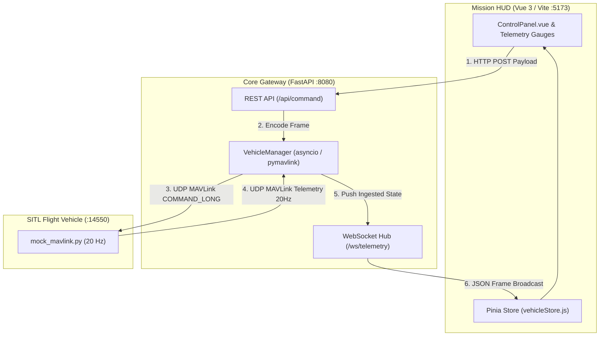

# Ground Control Station (GCS) & Avionics Testbed


A full-stack Ground Control Station and Hardware-in-the-Loop (HIL) testbed built with **FastAPI**, **Vue 3**, and **MAVLink v2**. 

It handles bidirectional vehicle operations: streaming telemetry down from an autopilot over UDP at 20 Hz, broadcasting it to a browser HUD via WebSockets, and uplinking commands (Arm/Disarm, Flight Modes) back to the vehicle with verified hardware acknowledgments.

---

## Architecture

Telemetry streaming and command uplinks are completely decoupled to prevent command latency or head-of-line blocking:



* **Downlink (Telemetry @ 20 Hz):** The SITL feeder generates binary MAVLink datagrams over UDP port `14550`. FastAPI drains the socket non-blockingly, caches current flight state, and fans out JSON frames over WebSockets.
* **Uplink (Commanding):** HUD actions issue an HTTP `POST` to `/api/command`. The backend parses the payload into a typed MAVLink `COMMAND_LONG` or `SET_MODE` packet and transmits it over UDP to the vehicle.
* **Telemetry-Verified State:** The UI never flips state optimistically. The propulsion indicator only switches to **ARMED** once the autopilot returns a valid `COMMAND_ACK` and sets the `MAV_MODE_FLAG_SAFETY_ARMED` bit (`0x80`) in its outbound `HEARTBEAT` stream.

---

## Technical Edge Cases & Engineering Notes

### 1. UDP vs TCP for Flight Telemetry
Standard web services rely on TCP, but TCP introduces Head-of-Line (HoL) blocking. Over a lossy RF link, a dropped attitude packet at $t = 100\text{ ms}$ stalls the connection while the protocol waits for a retransmission—rendering data stale on arrival. Using UDP allows the ingest loop to discard dropped or late packets instantly, ensuring the HUD renders current flight data.

### 2. Windows Winsock Sockets
Running non-blocking UDP sockets under Windows required addressing two OS-level Winsock quirks:
* **`WinError 10022` (`WSAEINVAL`):** Calling `recvfrom()` on an unbound non-blocking UDP socket is valid on Linux (which assigns an ephemeral port automatically), but fails on Windows. Explicitly calling `mav.port.bind(('', 0))` fixes this.
* **`WinError 10054` (`WSAECONNRESET`):** If UDP packets are transmitted before the backend binds port 14550, Windows catches the ICMP "Port Unreachable" response and raises `ConnectionResetError` on the *next* read. The ingest loop wraps reads in non-blocking exception guards to swallow cold-start resets cleanly.

### 3. Defensive Frontend Lifecycles
All feedback timers are tied to component unmount hooks (`onUnmounted`). Triggering multiple commands in rapid succession clears any active timer before starting a new one, preventing race conditions from wiping newer status messages prematurely or leaking memory.

---

## Telemetry & Command Specifications

### Ingested MAVLink Frames

| Message | ID | Decoded Parameters | Ingest Rate |
| :--- | :--- | :--- | :--- |
| **`HEARTBEAT`** | `#0` | Arm status bitmask (`0x80`), Custom flight mode | 1 Hz |
| **`ATTITUDE`** | `#30` | Roll (rad), Pitch (rad), Yaw (rad) | 20 Hz |
| **`GLOBAL_POSITION_INT`** | `#33` | Relative Altitude AGL (mm), Ground speed (cm/s), Heading (cdeg) | 10 Hz |
| **`SYS_STATUS`** | `#1` | Battery voltage (mV), Remaining capacity (%) | 2 Hz |
| **`COMMAND_ACK`** | `#77` | Command confirmation ID, `MAV_RESULT_ACCEPTED` status | Event-driven |

### REST Uplink Schema

```http
POST /api/command HTTP/1.1
Content-Type: application/json

{
  "command": "ARM",
  "mode": null
}
```

```http
POST /api/command HTTP/1.1
Content-Type: application/json

{
  "command": "SET_MODE",
  "mode": "RTL"
}
```

---

## Directory Structure

```text
├── backend/
│   ├── app/
│   │   ├── routers/
│   │   │   ├── commands.py        # POST /api/command uplink endpoint
│   │   │   ├── telemetry.py       # REST telemetry snapshot
│   │   │   └── ws.py              # WebSocket broadcast hub
│   │   ├── main.py                # FastAPI application & lifespan manager
│   │   ├── models.py              # Pydantic schemas
│   │   └── vehicle.py             # Asynchronous pymavlink ingest loop
│   └── requirements.txt
├── frontend/
│   ├── src/
│   │   ├── components/
│   │   │   ├── ControlPanel.vue   # Arm/Disarm safety toggles & mode select
│   │   │   └── TelemetryCard.vue  # Real-time gauge readouts
│   │   ├── stores/
│   │   │   └── vehicleStore.js    # Pinia telemetry state store
│   │   └── App.vue                # Main console layout & WS lifecycle
│   └── package.json
├── scripts/
│   └── mock_mavlink.py            # 20 Hz bidirectional SITL simulation script
└── launch.ps1                     # Root orchestration script (PowerShell)
```

---

## Quickstart

### Automated Launch (Recommended)
Clone the repository and run the PowerShell orchestrator:

```powershell
.\launch.ps1
```

The script verifies dependencies and launches each process in its own window:
* **Mission Backend:** `http://localhost:8080`
* **Mission Console HUD:** `http://localhost:5173`
* **Mock SITL Feeder:** UDP broadcast to `127.0.0.1:14550`

---

### Manual Launch

**1. Backend Gateway**
```powershell
cd backend
.\.venv\Scripts\Activate.ps1
uvicorn app.main:app --host 0.0.0.0 --port 8080 --reload
```

**2. Mission Console**
```powershell
cd frontend
npm install
npm run dev
```

**3. SITL Simulator**
```powershell
cd backend
.\.venv\Scripts\Activate.ps1
python ..\scripts\mock_mavlink.py
```

---

## Verification Sequence

1. Open `http://localhost:5173`. Confirm the top-right indicator shows **`LINK ACTIVE`** and the propulsion badge shows **`DISARMED`**.
2. Click **`ARM PROPULSION`**.
   * Status updates to `TRANSMITTING ARM...` and then locks into `UPLINK ACKNOWLEDGED: ARM`.
   * SITL terminal confirms: `[SITL RX] Propulsion Interlock -> ARMED`.
   * HUD badge turns red **`ARMED`**, and simulated vehicle climb and ground speed begin accelerating.
3. Select **`RTL`** from the mode selector and click **`SET MODE`**.
   * SITL terminal confirms: `[SITL RX] Mode Switched -> ID 6`.
   * HUD flight mode updates to **`RTL`**.
4. Click **`FORCE DISARM`**.
   * SITL terminal registers `[SITL RX] Propulsion Interlock -> DISARMED`.
   * Altitude and ground speed decay to zero.

---

## Roadmap

- [x] Bidirectional UDP MAVLink translation layer
- [x] Real-time WebSocket telemetry distribution
- [x] Interlocked propulsion state & flight mode uplinks
- [x] Windows Winsock socket hardening (`10022` / `10054`)
- [ ] **Attitude Director Indicator (ADI):** SVG-based artificial horizon with pitch ladders and roll arcs.
- [ ] **Telemetry Watchdog:** Sequence tracking and visual alerts if packet frequency drops below 5 Hz.
- [ ] **Waypoint Upload:** Support waypoint mission planning using the MAVLink `MISSION_ITEM_INT` protocol sequence.
```markdown
# Autonomous Flight Core: Ground Control Station & HIL Testbed


An asynchronous, hardware-agnostic Ground Control Station (GCS) and Hardware-in-the-Loop (HIL) telemetry testbed built from first principles. Ingests native binary MAVLink 2.0 telemetry streams over UDP, computes transport-layer frame loss via 8-bit unsigned modular arithmetic, and renders low-latency telemetry to a cockpit interface compliant with MIL-STD-1787C human-factors specifications.


```

# ========================================================================================
[VEHICLE / SITL / HARDWARE TESTBED]  ──(UDP:14550 MAVLink 2.0)──►  [FASTAPI TELEMETRY CORE]
│
┌─────────────────────────────────────────────────────────────────────┴────────┐
▼ (20 Hz Non-Blocking Async WebSocket)                                         ▼ (REST /api)
[VUE 3 MISSION CONSOLE]                                                   [COMMAND DISPATCH]
├── MIL-STD-1787C Primary Flight Display (Pure SVG ADI)                   ├── Mode Transitions
├── Tactical Moving Map (Leaflet / CartoDB Dark Matter)                   └── Arm/Disarm Interlocks
├── Modulo-256 Packet Loss Watchdog Engine                                    (Strict Bitmask 0x80)
└── Web Audio API Caution Synthesizer (750/900 Hz Dual Tone)

```

---

## Key Subsystems

### 1. Transport & Ingestion Layer
* **Non-Blocking Ingestion:** Powered by Python's `asyncio` loop and `pymavlink` bound to UDP port `14550`. Ingest operations are decoupled from HTTP serving threads to prevent Head-of-Line (HoL) blocking and gracefully absorb socket resets (`WSAECONNRESET` / `WinError 10054`).
* **High-Frequency WebSocket Fanout:** Pydantic-validated telemetry frames are broadcast to connected client consoles at a synchronized 20 Hz update rate.

### 2. Protocol Integrity & Modulo-256 Loss Tracking
Packet drop rates are calculated at the transport boundary using MAVLink's 8-bit wire sequence counter ($0 \to 255$):

$$\Delta \text{seq} = (\text{seq}_{\text{curr}} - \text{seq}_{\text{last}} - 1) \pmod{256}$$

* **Rollover Invariance:** Handles $255 \to 0$ unsigned wrapping without false drop alerts.
* **Duplicate & Delay Gating:** Uses an acceptance window ($0 < \Delta \text{seq} < 50$) to reject duplicate frames and severely delayed packets from distorting cumulative loss statistics.

### 3. Mission-Critical Command Interlocks
* **Authoritative Vehicle State:** Follows flight software interlock standards. Local UI state never mutates optimistically upon command dispatch.
* **Telemetry Bitmask Verification:** Dispatching `/api/command/arm` transmits a `MAV_CMD_COMPONENT_ARM_DISARM` long packet. The system only reports `ARMED` once the flight computer echoes confirmation via the `MAV_MODE_FLAG_SAFETY_ARMED` (`0x80`) bitmask in downlinked `HEARTBEAT` messages.

### 4. Primary Flight Display & Tactical GIS
* **Attitude Director Indicator (ADI):** Vector-based artificial horizon drawn in pure SVG, dynamically calculating pitch ladder translations and roll angles in real time.
* **Tactical Moving Map:** Leaflet.js engine integrated with CartoDB Dark Matter monochrome tiles, dynamic SVG heading chevrons, and rolling 150-coordinate flight breadcrumbs centered on Mojave Air and Space Port ($35.0594^\circ\text{ N}, -118.1517^\circ\text{ W}$).

### 5. Native Synthetic Audio System
* **Zero Audio Asset Dependencies:** Generates dual-frequency caution alarms (750 Hz / 900 Hz alternating square waves) directly in browser memory via the Web Audio API (`AudioContext`, `OscillatorNode`, `GainNode`).
* **Heartbeat Watchdog:** Automatically triggers caution tones if packet arrival stalls exceed 1,200 ms or the socket connection closes.

---

## Automated Verification Suite

Unit and integration tests run headlessly in isolated memory spaces using `pytest` and `pytest-asyncio`:

```text
============================= test session starts ==============================
platform win32 -- Python 3.11.9, pytest-9.1.1, pluggy-1.6.0
plugins: anyio-4.15.1, asyncio-1.4.0

tests/test_api.py::test_health PASSED                                     [  8%]
tests/test_command_interlocks.py::TestCommandInterlocks::test_arm_command_dispatch_does_not_optimistically_arm PASSED [ 16%]
tests/test_command_interlocks.py::TestCommandInterlocks::test_emergency_motor_cutoff_validates_payload PASSED [ 25%]
tests/test_command_interlocks.py::TestCommandInterlocks::test_telemetry_schema_snapshot PASSED                 [ 33%]
tests/test_command_interlocks.py::TestCommandInterlocks::test_authoritative_heartbeat_state_transition PASSED [ 41%]
tests/test_mavlink_integrity.py::TestMavlinkSequenceMath::test_nominal_continuous_stream PASSED                [ 50%]
tests/test_mavlink_integrity.py::TestMavlinkSequenceMath::test_single_packet_drop PASSED                      [ 58%]
tests/test_mavlink_integrity.py::TestMavlinkSequenceMath::test_multi_packet_burst_loss PASSED                  [ 66%]
tests/test_mavlink_integrity.py::TestMavlinkSequenceMath::test_uint8_rollover_nominal PASSED                  [ 75%]
tests/test_mavlink_integrity.py::TestMavlinkSequenceMath::test_uint8_rollover_with_loss PASSED                 [ 83%]
tests/test_mavlink_integrity.py::TestMavlinkSequenceMath::test_duplicate_frame_rejection PASSED               [ 91%]
tests/test_mavlink_integrity.py::TestVehicleManagerPacketIntegration::test_vehicle_manager_ingestion_updates_loss PASSED [100%]

============================== 12 passed in 0.06s ==============================

```

---

## Directory Layout

```
.
├── backend/
│   ├── app/
│   │   ├── config.py             # System & connection settings
│   │   ├── main.py               # FastAPI routes, REST endpoints & WebSockets
│   │   ├── schemas.py            # Pydantic telemetry models
│   │   └── vehicle.py            # UDP MAVLink ingestion loop & state tracking
│   ├── scripts/
│   │   └── mock_mavlink.py       # Kinematic flight sim & telemetry generator
│   └── tests/
│       ├── conftest.py           # Pytest fixtures & async HTTP test client
│       ├── test_api.py           # API health check verification
│       ├── test_command_interlocks.py  # Safety state machine tests
│       └── test_mavlink_integrity.py   # Modulo-256 math & packet drop tests
└── frontend/
    ├── src/
    │   ├── components/
    │   │   ├── ArtificialHorizon.vue # MIL-STD-1787C Primary Flight Display
    │   │   ├── ControlPanel.vue      # Command uplink buttons & safety interlocks
    │   │   ├── TacticalMap.vue       # Leaflet moving map with CartoDB dark tiles
    │   │   └── TelemetryCard.vue     # High-contrast instrumentation readouts
    │   ├── stores/
    │   │   └── vehicleStore.js       # Pinia reactive telemetry state
    │   ├── utils/
    │   │   └── audioCaution.js       # Native Web Audio API dual-tone synthesizer
    │   ├── App.vue                   # Dual-deck cockpit interface
    │   └── main.js
    └── package.json

```

---

## Quickstart & Local Setup

### Prerequisites

* Python 3.11+
* Node.js 18+ & npm

### 1. Backend Service

```bash
cd backend
python -m venv .venv

# Windows
.venv\Scripts\activate
# Linux/macOS
# source .venv/bin/activate

pip install -r requirements.txt
python -m pytest tests/ -v
uvicorn app.main:app --host 0.0.0.0 --port 8080

```

### 2. Frontend Mission Console

```bash
cd frontend
npm install
npm run dev

```

Open [http://localhost:5173](http://localhost:5173?utm_source=gemini) in your browser.

### 3. Flight Telemetry Simulator (HIL Stream)

In a separate terminal, launch the mock kinematics script:

```bash
cd backend
# With virtual environment active
python scripts/mock_mavlink.py

```

---

## Compatibility

The ingestion engine binds to standard UDP port `14550` using standard MAVLink 2.0 framing, allowing drop-in compatibility with:

* **ArduPilot SITL / PX4 SITL** simulation environments
* **Physical Pixhawk / Cube flight controllers** via serial-to-UDP telemetry bridges (`mavproxy` / `mavp2p`)
* **Hardware-in-the-Loop (HIL)** telemetry benches over SiK 915 MHz or RFD900 radio transceivers

---

## License

This project is licensed under the MIT License. See the [LICENSE](https://www.google.com/search?q=LICENSE&utm_source=gemini) file for details.

```

```