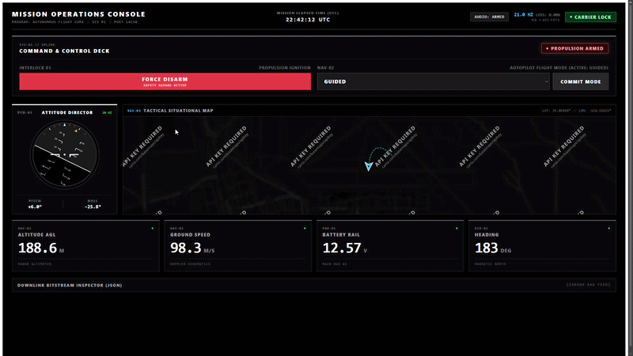
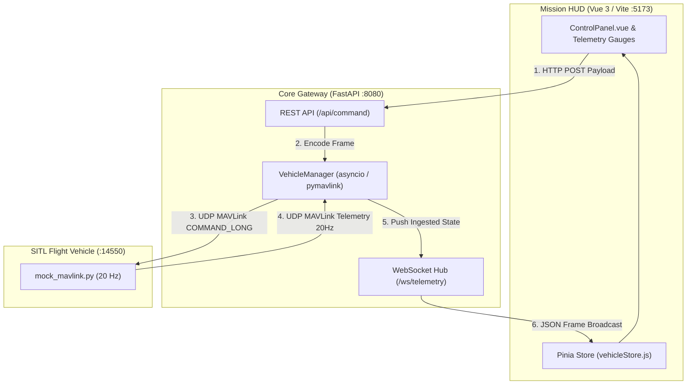

# Autonomous Flight Core: Ground Control Station & HIL Testbed - PROTOTYPE


<p align="center">
  
</p>


A full-stack Ground Control Station and Hardware-in-the-Loop (HIL) testbed built with **FastAPI**, **Vue 3**, and **MAVLink v2**. 

It handles bidirectional vehicle operations: streaming telemetry down from an autopilot over UDP at 20 Hz, broadcasting it to a browser HUD via WebSockets, and uplinking commands (Arm/Disarm, Flight Modes) back to the vehicle with verified hardware acknowledgments.

---

## Architecture

Telemetry streaming and command uplinks are completely decoupled to prevent command latency or head-of-line blocking:



* **Downlink (Telemetry @ 20 Hz):** The SITL feeder generates binary MAVLink datagrams over UDP port `14550`. FastAPI drains the socket non-blockingly, caches current flight state, and fans out JSON frames over WebSockets.
* **Uplink (Commanding):** HUD actions issue an HTTP `POST` to `/api/command`. The backend parses the payload into a typed MAVLink `COMMAND_LONG` or `SET_MODE` packet and transmits it over UDP to the vehicle.
* **Telemetry-Verified State:** The UI never flips state optimistically. The propulsion indicator only switches to **ARMED** once the autopilot returns a valid `COMMAND_ACK` and sets the `MAV_MODE_FLAG_SAFETY_ARMED` bit (`0x80`) in its outbound `HEARTBEAT` stream.

---

## Technical Edge Cases & Engineering Notes

### 1. UDP vs TCP for Flight Telemetry
Standard web services rely on TCP, but TCP introduces Head-of-Line (HoL) blocking. Over a lossy RF link, a dropped attitude packet at $t = 100\text{ ms}$ stalls the connection while the protocol waits for a retransmission—rendering data stale on arrival. Using UDP allows the ingest loop to discard dropped or late packets instantly, ensuring the HUD renders current flight data.

### 2. Windows Winsock Sockets
Running non-blocking UDP sockets under Windows required addressing two OS-level Winsock quirks:
* **`WinError 10022` (`WSAEINVAL`):** Calling `recvfrom()` on an unbound non-blocking UDP socket is valid on Linux (which assigns an ephemeral port automatically), but fails on Windows. Explicitly calling `mav.port.bind(('', 0))` fixes this.
* **`WinError 10054` (`WSAECONNRESET`):** If UDP packets are transmitted before the backend binds port 14550, Windows catches the ICMP "Port Unreachable" response and raises `ConnectionResetError` on the *next* read. The ingest loop wraps reads in non-blocking exception guards to swallow cold-start resets cleanly.

### 3. Defensive Frontend Lifecycles
All feedback timers are tied to component unmount hooks (`onUnmounted`). Triggering multiple commands in rapid succession clears any active timer before starting a new one, preventing race conditions from wiping newer status messages prematurely or leaking memory.

---

## Telemetry & Command Specifications

### Ingested MAVLink Frames

| Message | ID | Decoded Parameters | Ingest Rate |
| :--- | :--- | :--- | :--- |
| **`HEARTBEAT`** | `#0` | Arm status bitmask (`0x80`), Custom flight mode | 1 Hz |
| **`ATTITUDE`** | `#30` | Roll (rad), Pitch (rad), Yaw (rad) | 20 Hz |
| **`GLOBAL_POSITION_INT`** | `#33` | Relative Altitude AGL (mm), Ground speed (cm/s), Heading (cdeg) | 10 Hz |
| **`SYS_STATUS`** | `#1` | Battery voltage (mV), Remaining capacity (%) | 2 Hz |
| **`COMMAND_ACK`** | `#77` | Command confirmation ID, `MAV_RESULT_ACCEPTED` status | Event-driven |

### REST Uplink Schema

```http
POST /api/command HTTP/1.1
Content-Type: application/json

{
  "command": "ARM",
  "mode": null
}
```

```http
POST /api/command HTTP/1.1
Content-Type: application/json

{
  "command": "SET_MODE",
  "mode": "RTL"
}
```

---

## Directory Structure

```text
.
├── backend/
│   ├── app/
│   │   ├── config.py             # System & connection configuration
│   │   ├── main.py               # FastAPI routes, REST endpoints & WebSocket broadcaster
│   │   ├── schemas.py            # Pydantic telemetry models
│   │   └── vehicle.py            # UDP MAVLink ingestion loop & state tracking
│   ├── scripts/
│   │   └── mock_mavlink.py       # Kinematic flight sim & telemetry generator
│   └── tests/
│       ├── conftest.py           # Pytest fixtures & async HTTP test client
│       ├── test_api.py           # API health check verification
│       ├── test_command_interlocks.py  # Safety state machine tests
│       └── test_mavlink_integrity.py   # Modulo-256 math & packet drop tests
└── frontend/
    ├── src/
    │   ├── components/
    │   │   ├── ArtificialHorizon.vue # MIL-STD-1787C Primary Flight Display
    │   │   ├── ControlPanel.vue      # Command uplink buttons & safety interlocks
    │   │   ├── TacticalMap.vue       # Leaflet moving map with CartoDB dark tiles
    │   │   └── TelemetryCard.vue     # High-contrast instrumentation readouts
    │   ├── stores/
    │   │   └── vehicleStore.js       # Pinia reactive telemetry state
    │   ├── utils/
    │   │   └── audioCaution.js       # Native Web Audio API dual-tone synthesizer
    │   ├── App.vue                   # Dual-deck cockpit interface
    │   └── main.js
    └── package.json

```

---

## Quickstart

### Automated Launch (Recommended)
Clone the repository and run the PowerShell orchestrator:

```powershell
.\launch.ps1
```

The script verifies dependencies and launches each process in its own window:
* **Mission Backend:** `http://localhost:8080`
* **Mission Console HUD:** `http://localhost:5173`
* **Mock SITL Feeder:** UDP broadcast to `127.0.0.1:14550`

---

### Manual Launch

**1. Backend Gateway**
```powershell
cd backend
python -m venv .venv

# Windows
.venv\Scripts\activate
# Linux/macOS
# source .venv/bin/activate

pip install -r requirements.txt
python -m pytest tests/ -v
uvicorn app.main:app --host 0.0.0.0 --port 8080

```

### Step 2: Frontend Mission Console

```bash
cd frontend
npm install
npm run dev

```

Open `http://localhost:5173` in your browser.

### Step 3: Flight Telemetry Simulator (HIL Stream)

In a separate terminal, launch the mock kinematics script:

```bash
cd backend
# With virtual environment active:
python scripts/mock_mavlink.py

```

---

## Verification Sequence

1. Open `http://localhost:5173`. Confirm the top-right indicator shows **`LINK ACTIVE`** and the propulsion badge shows **`DISARMED`**.
2. Click **`ARM PROPULSION`**.
   * Status updates to `TRANSMITTING ARM...` and then locks into `UPLINK ACKNOWLEDGED: ARM`.
   * SITL terminal confirms: `[SITL RX] Propulsion Interlock -> ARMED`.
   * HUD badge turns red **`ARMED`**, and simulated vehicle climb and ground speed begin accelerating.
3. Select **`RTL`** from the mode selector and click **`SET MODE`**.
   * SITL terminal confirms: `[SITL RX] Mode Switched -> ID 6`.
   * HUD flight mode updates to **`RTL`**.
4. Click **`FORCE DISARM`**.
   * SITL terminal registers `[SITL RX] Propulsion Interlock -> DISARMED`.
   * Altitude and ground speed decay to zero.

---

## Roadmap

- [x] Bidirectional UDP MAVLink translation layer
- [x] Real-time WebSocket telemetry distribution
- [x] Interlocked propulsion state & flight mode uplinks
- [x] Windows Winsock socket hardening (`10022` / `10054`)
- [ ] **Attitude Director Indicator (ADI):** SVG-based artificial horizon with pitch ladders and roll arcs.
- [ ] **Telemetry Watchdog:** Sequence tracking and visual alerts if packet frequency drops below 5 Hz.
- [ ] **Waypoint Upload:** Support waypoint mission planning using the MAVLink `MISSION_ITEM_INT` protocol sequence.
